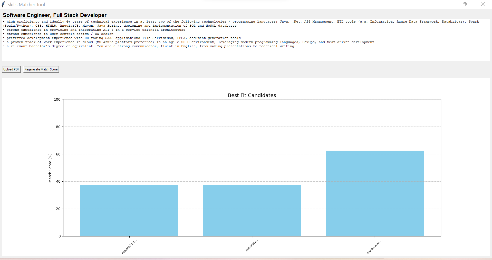

# getting-best-brains-togetter

It is a python utility to check the compatibility between resumes and a job description
It finds the best of the available resumes for a specific job.
 
The program uses selenium library to fetch job description from job portal
 and NLTK library to extract keywords from resume/CV and JD.

The utility generates a graphical output with matching results.

1)Prepare Data:
Resumes: Place your resumes in PDF/docx format in the data/input/Resumes folder or uses UI to upload a resume.
Job Descriptions: Update link for corresponding job from a portal

2)Run the application
python main.py

final output look like this -

Presentation - https://www.youtube.com/watch?v=oXeS2_YNXA4